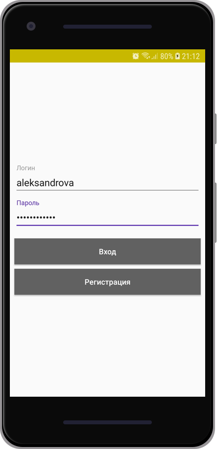
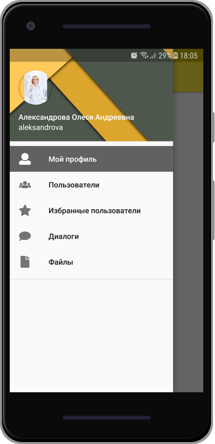
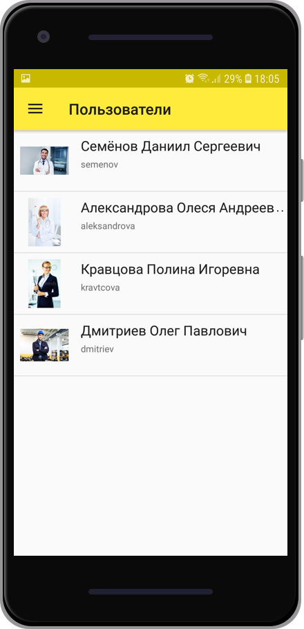
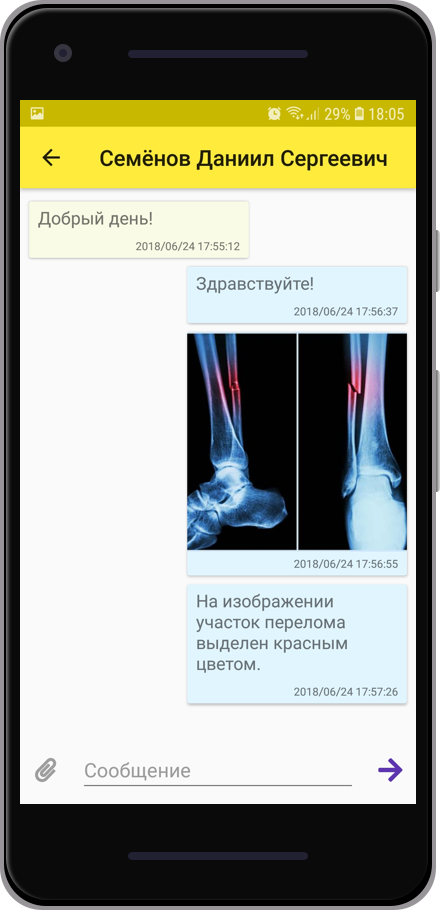
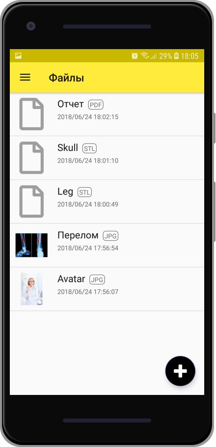
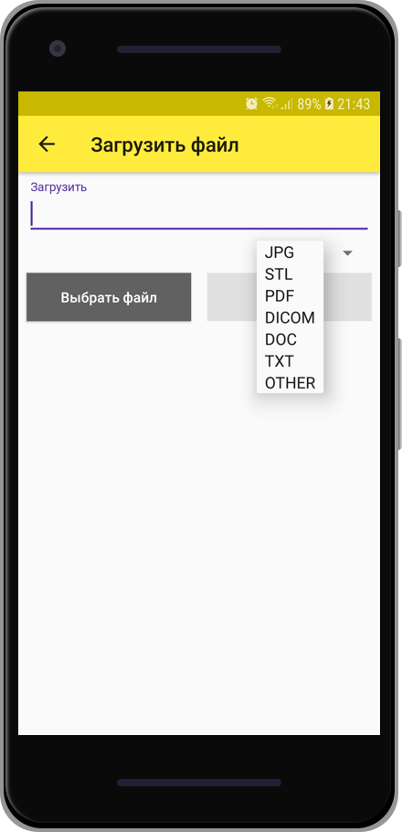

# Social Medical Network
The Android application of my graduation project - Social medical network **"Concilium"**. The app uses Android Architecture Components + RxJava 2 + Retrofit 2 + Dagger 2.

## Back-End
See this [link](https://github.com/belogurow/Diploma-server) for back-end project on Spring Boot 2.0 of this social medical network.

## Building the project
Clone this repository and configure URL address of your server in ``App.java`` file:
```java
private static final String URL = "10.0.2.2:8090";
```
Run.

## App features
* Authorization and authentication;
* Section of favorite users;
* Requests using HTTPS;
* Dialogs using WebSocket;
* Uploading files of different formats;
* Viewer of STL, PDF and JPG files;
* Languages:
    * English
    * Russian

## Screenshots






